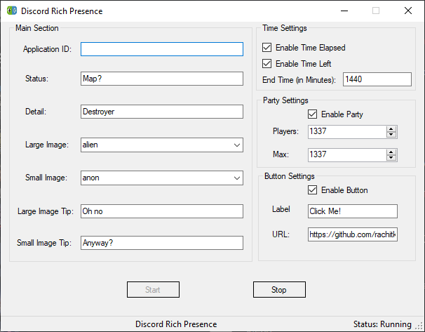
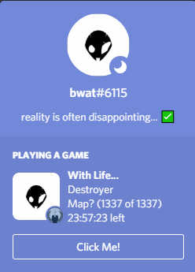

# Discord Rich Presence

This application can be used to have your own Discord Rich Presence.

App name will always represent the one mentioned in the [Discord Developer Portal](https://discord.com/developers/applications)

# Features

- Lists images automatically using Discord API.
- Minimize to tray.
- Based on .NET Framework.
- Portable and Compact in size.
- Open source.

# Screenshots

# Requirements:
[.NET Framework 4.7.2](https://dotnet.microsoft.com/download/dotnet-framework/net472)

# Known Issue:
- Changing too quicky repeatedly blocks it from server side. (Will be restored when server allows)
Possible fix: Restart Discord.

# Credits:

[Lachee](https://github.com/Lachee/) for [discord-rpc-csharp](https://github.com/Lachee/discord-rpc-csharp/)

[Newtonsoft](https://www.newtonsoft.com/) for [Newtonsoft.Json](https://github.com/JamesNK/Newtonsoft.Json)

## Disclaimer:

>I am not responsible for any illegal use of this application or for any Bans received while using this application.
